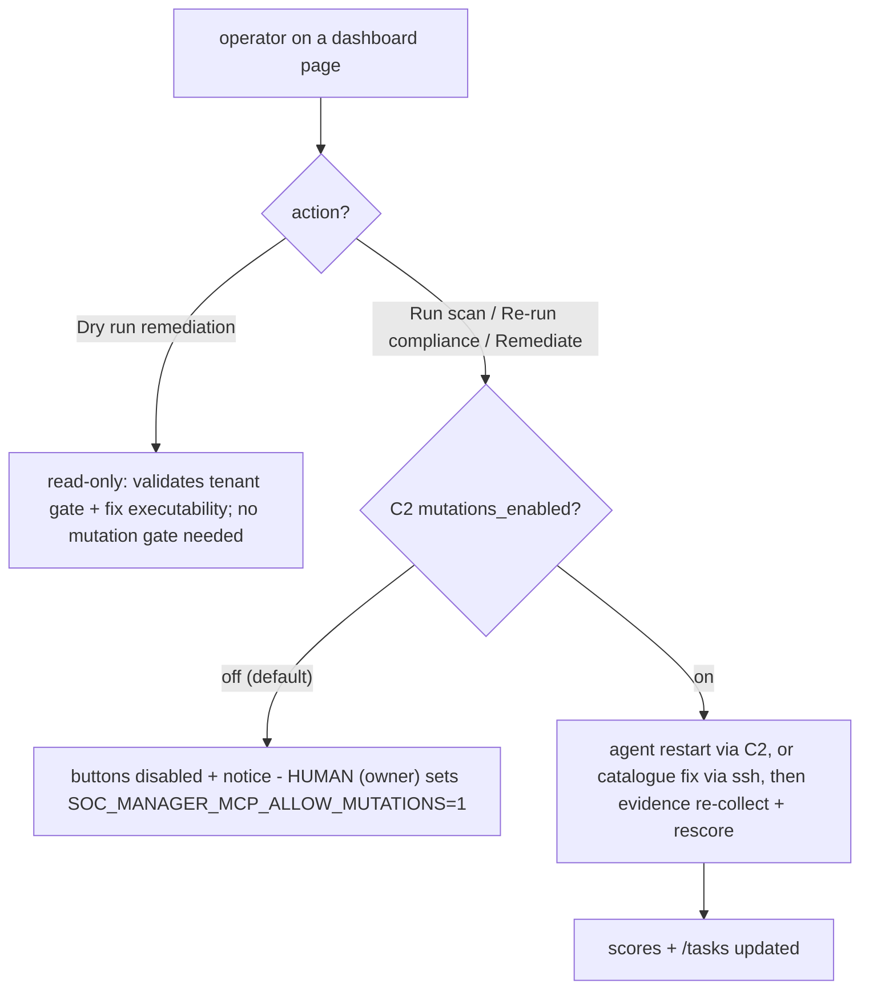

# Architecture

## Components

### Wazuh stack (docker)
Manager (:55000 API, :1514/:1515 agent ingestion), indexer (9200),
dashboard. Agents run on every managed system. The manager carries a
custom integration (`wazuh/integrations/agentic-soc-send.py`,
bind-mounted to `/var/ossec/integrations/`) that fires on configured
rule levels: it narrates the alert via `soc-narrator`, decides via
`soc-triage`, e-mails the digest via the reports mailbox, and POSTs the
alert to the realtime ingest server.

### Realtime ingest (:8765)
Receives alerts (`POST /ingest`), triages (full `SecurityOperationsAgent`
if the operator supplies the `agentic_ai` project, otherwise the lite
backend triaging through the OpenClaw `soc-triage` sub-agent), escalates
high/critical alerts into incidents, and appends everything to a JSONL
log (`$SOC_STATE_DIR/data/realtime_soc.jsonl`) — the durable record the
daily decisions report reads.

### MCP backends
| Server | Port | Data |
|---|---|---|
| soc-manager-mcp | 8767 | Wazuh manager REST API (fleet, rules, gated mutations) |
| soc-tickets-mcp | 8768 | SQLite ticket store (create/comment/close workflow) |
| soc-audit-mcp | 8769 | The SOC audit log (every LLM call + agent run) |
| soc-memory-mcp | 8766+ | Cross-incident memory, tenant-scoped |

### Dashboard (:8771)
Python HTTP server that proxies `/tools/<name>` calls to the MCP
backends and renders the SPA (Overview, Fleet, Scores, STIG, Tenants,
Agents, Tickets, Health, per-host CVE/Logs/STIG drill-downs). Read paths
are open; mutating actions (Run scan, Re-run compliance scan, Remediate)
are gated on the manager's `mutations_enabled` and render disabled with
a notice while `SOC_MANAGER_MCP_ALLOW_MUTATIONS=1` is unset.

### Daily decisions (timer, 06:00 UTC)
Reads the audit log + the realtime JSONL for "today" and writes a
Markdown decisions report to memory — the D1 artifact.

## Sub-agent fleet

Six OpenClaw agents, one concern each, all invoked through
`lib/llm_runtime.py` (openclaw harness first, Ollama fallback, audit row
on every call). Workspaces live under `$SOC_AGENTS_DIR/<id>/` with
IDENTITY/MEMORY/AGENTS/USER files copied from `agents/<id>/` — the repo
is the source of truth for personas.

## Data flow for one alert

1. Wazuh agent on a managed system detects a match → alert hits the
   manager.
2. `agentic-soc-send.py` runs: denylist → `soc-triage` decision →
   email (if recipient/routing says so) → `POST :8765/ingest`.
3. Realtime ingest triages/logs; auto-escalation writes an incident.
4. The dashboard shows fleet health, the ticket queue, scores, and the
   realtime feed; tickets are worked to closure with full audit trails.

## Scheduled flows — the cron map

| Timer | When | What it does | Output lands in |
|---|---|---|---|
| `soc-audit-shipper.timer` | every 5 min | tails the audit JSONL, forwards new rows over SSH to trooper2 | trooper2 canonical JSONL (curator/reviewers) |
| `soc-realtime-shipper.timer` | every 5 min | tails the realtime JSONL, same one-way mirror | trooper2 canonical JSONL |
| `soc-healthcheck.timer` | hourly (:00) | unit/ACL/state-drift assertions; OnFailure alerting | journal + operator ping on failure |
| `soc-daily-decisions.timer` | 06:00 UTC | reads audit log + realtime JSONL for the day, writes the D1 decisions report | markdown report file (delivery = G8, pending) |
| `soc-compliance-daily.timer` | 06:30 UTC | collect → merge archived scans → auto-remediate (local + fleet) → re-collect → score | evidence store, scores, journal rollup |
| `soc-scan-weekly.timer` | Sunday 03:00 UTC | staggered per-host OpenSCAP scans over SSH → archive → collect + score | `scans/<day>/`, tasklog rows, scores |

## The decision tree

Everything below is automation completing work; nodes marked **HUMAN**
are the handoff points where work stops and waits for a person.

```mermaid
flowchart TD
  classDef human fill:#fff3cd,stroke:#b8860b
  classDef gate fill:#ffe4e6,stroke:#be123c
  classDef store fill:#e2e8f0,stroke:#64748b

  subgraph LIVE["Live alert path - continuous"]
    A1["Wazuh agent detects on a managed host"] --> A2["Manager raises alert"]
    A2 --> G1{"rule level >= 12?"}:::gate
    G1 -- "no" --> A3[("indexer history only")]
    G1 -- "yes" --> A4["agentic-soc-send: narrator + triage agents"]
    A4 --> G2{"tenant routing allowed_actions?"}:::gate
    G2 -- "email/page" --> A5["digest email or page - HUMAN reads"]:::human
    G2 -- "log only" --> A8
    A4 --> A6["POST realtime-ingest :8765/ingest"]
    A6 --> G3{"severity high or critical?"}:::gate
    G3 -- "yes" --> A7["incident ticket - HUMAN queue"]:::human
    G3 -- "no" --> A8[("realtime JSONL + audit log")]:::store
    A7 --> A8
    A8 --> A9["stig classifier: attach stig_id + control"]
    A9 --> H1
  end

  subgraph SHIP["Record mirroring - every 5 min"]
    T5A["soc-audit-shipper"] --> S1["tail audit JSONL, ssh to trooper2"]
    T5B["soc-realtime-shipper"] --> S2["tail realtime JSONL, ssh to trooper2"]
    S1 --> H2[("trooper2: curator + reviewers read")]
    S2 --> H2
  end

  subgraph NIGHT["Nightly compliance loop - 06:30 UTC"]
    N0["soc-compliance-daily.timer"] --> N1["collect evidence, all tenants"]
    N1 --> N2{"scans archived today?"}:::gate
    N2 -- "yes" --> N3["merge scan results into evidence, worst across hosts"]
    N2 -- "no" --> N5
    N3 --> N5{"SOC_AUTO_REMEDIATE=1?"}:::gate
    N5 -- "no" --> N9
    N5 -- "yes" --> N6["local pass: non-pass controls, automated + pure-shell fix"]
    N6 --> G4{"tenant gate: allowed_actions, threshold, severity"}:::gate
    G4 -- "eligible" --> N7["sudo apply + snapshot + audit row"]
    G4 -- "refused" --> N8[("refused row - neutral, never fail-grade - HUMAN decides"):::human]
    N7 --> N8b["re-collect evidence"]
    N8 --> N9
    N8b --> N9["fleet pass: failing host+control pairs from scans"]
    N9 --> G5{"host in allowlist?"}:::gate
    G5 -- "no" --> N10[("skipped")]
    G5 -- "yes" --> G6{"automated + shell fix + tenant gate"}:::gate
    G6 -- "eligible" --> N11["ssh wez@host + sudo apply + audit row"]
    G6 -- "refused or failed" --> N12[("refused/failed row - HUMAN investigates"):::human]
    N11 --> G7{"any applied?"}:::gate
    G7 -- "yes" --> N13["re-collect: audit PASS grades win over stale scan FAIL"]
    G7 -- "no" --> N14
    N13 --> N14["score all tenants"]
    N10 --> N14
    N12 --> N14
    N14 --> N15["dashboard /scores trend + journal rollup"]
  end

  subgraph WEEK["Weekly scan sweep - Sunday 03:00 UTC"]
    W0["soc-scan-weekly.timer"] --> W1["staggered per-host OpenSCAP scans over ssh"]
    W1 --> W2["results archived to scans/day + tasklog rows"]
    W2 --> W3["collect day: merge + evidence + score"]
    W3 --> H3[("scans archive + evidence store")]:::store
  end

  subgraph DAY["Daily decisions report - 06:00 UTC"]
    D0["soc-daily-decisions.timer"] --> D1["read audit log + realtime JSONL"]
    D1 --> D2["markdown decisions report written"]
    D2 --> D3["delivery: email/agent ping still pending (G8) - HUMAN reads the file"]:::human
  end

  subgraph HOUR["Hourly healthcheck"]
    Z0["soc-healthcheck.timer"] --> Z1{"assertions pass?"}:::gate
    Z1 -- "no" --> Z2["OnFailure alert - HUMAN + managing agent"]:::human
    Z1 -- "yes" --> Z3[("healthcheck OK")]
  end

  H1 --> V1["dashboard :8771 - stig, tasks, scores, fleet drill-downs"]
  H3 --> V1
  N15 --> V1
```

## Dashboard mutation buttons — the operator gate



## Human handoffs — where automation stops

| Trigger | Lands where | How the human acts |
|---|---|---|
| High/critical L12+ alert | incident ticket + email digest | work the queue on `/tickets`; close with audit trail |
| Remediation refused by tenant policy | `refused` evidence row (neutral, never fail-grade) + journal | decide policy change, or apply manually (dashboard Remediate with mutations on, or CLI `sudo python3 services/soc_stig_remediate.py ...`) |
| Control not automatable (`automated: false`) | `manual` badge on the fleet-host OpenSCAP section | manual hardening on the host |
| Control severity below tenant eligibility (e.g. low) | nightly pass refuses by policy | same manual paths as above |
| Scan or apply failure | tasklog failed row (`/tasks`) + journal | investigate the host / fix, then re-run |
| Healthcheck assertion fails | OnFailure alert to operator + managing agent | repair (the managing agent usually self-serves) |
| Mutations gate off | dashboard buttons disabled with notice | owner uncomments the env line + restarts soc-manager-mcp |
| Anything at all | ask the managing OpenClaw agent in chat | it runs scans, repairs services, applies fixes, updates docs |

## Inspection and reports — when humans look

| What | When | Where |
|---|---|---|
| Decisions report (D1) | 06:00 UTC daily | markdown file (delivery pending, G8) |
| Compliance cycle rollup | 06:30 UTC daily | `journalctl -u soc-compliance-daily` (JSON: collect/oscap/remediate/scores) |
| Score trend | continuous | `/scores` on the dashboard |
| Fleet STIG posture | continuous | `/stig`, `/stig/host/<host>` |
| Per-host CVEs / logs | continuous | `/cve/<host>`, `/logs/<host>` |
| Automation evidence | on every timer run | `/tasks` tasklog rows |
| Weekly fresh scans | Sunday 03:00 UTC | `scans/<day>/` archive + `/fleet/<host>` control section |
5. The 06:00 UTC daily decisions report summarizes the day per tenant.