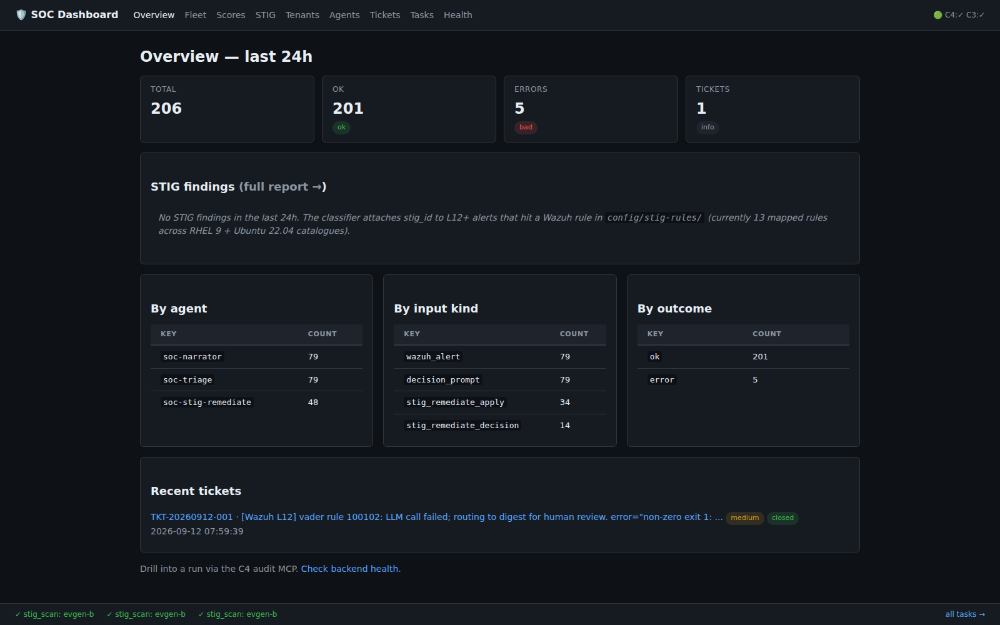
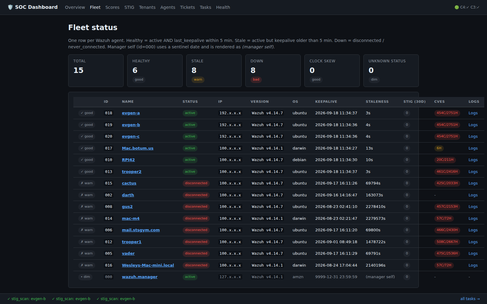
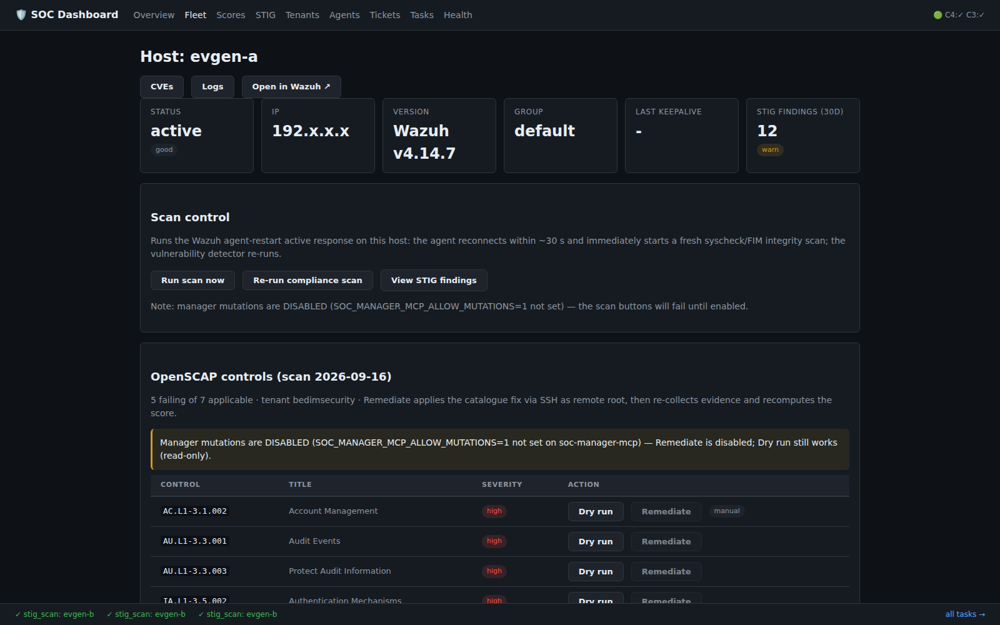
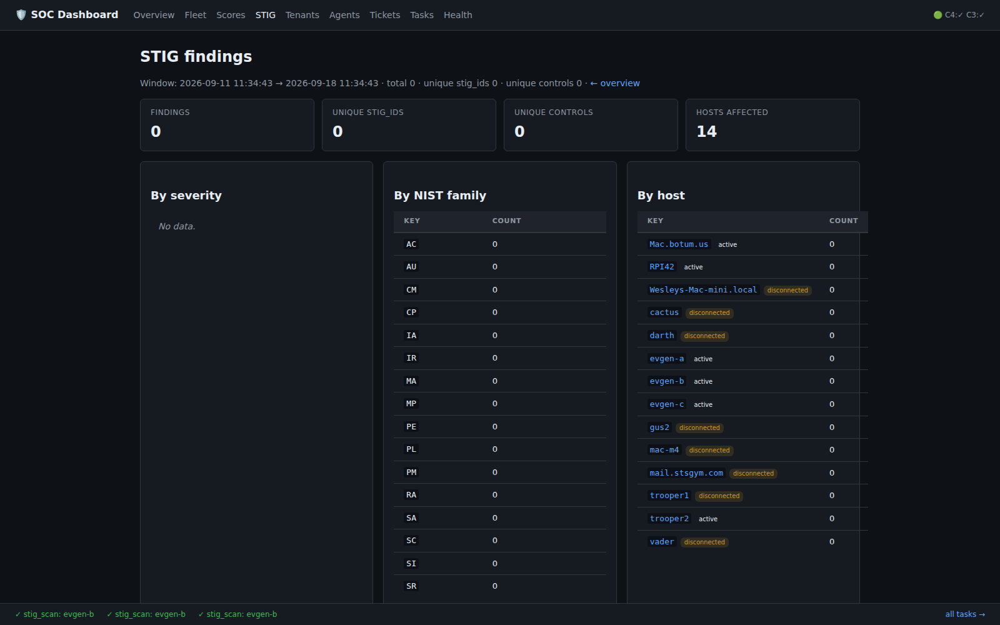
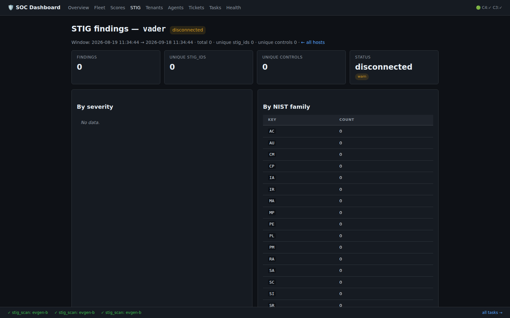
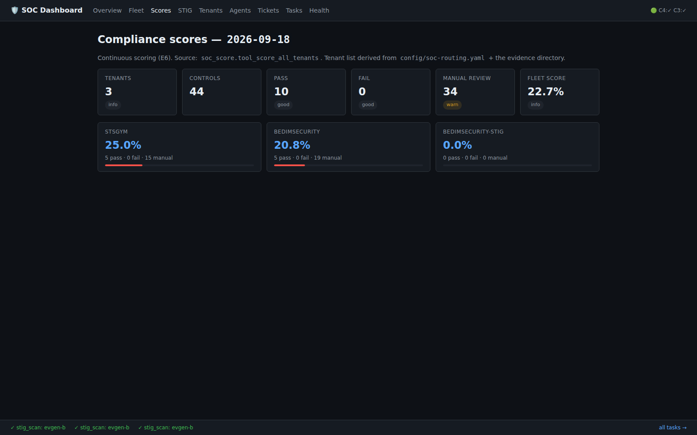
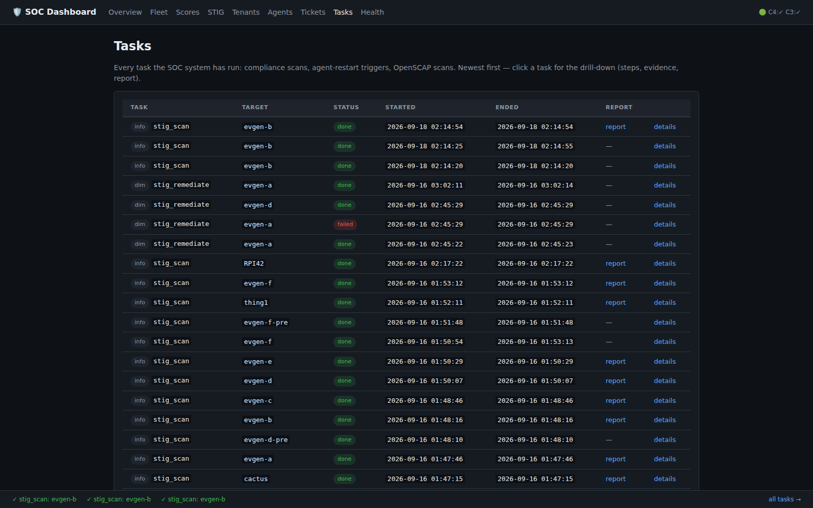
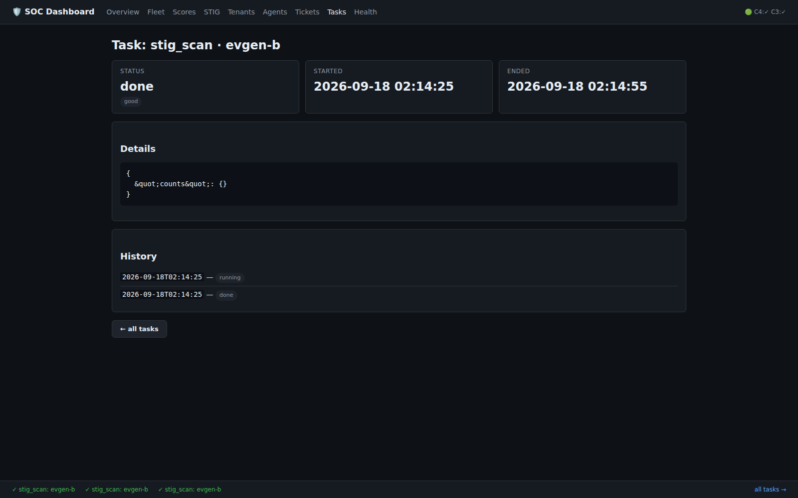
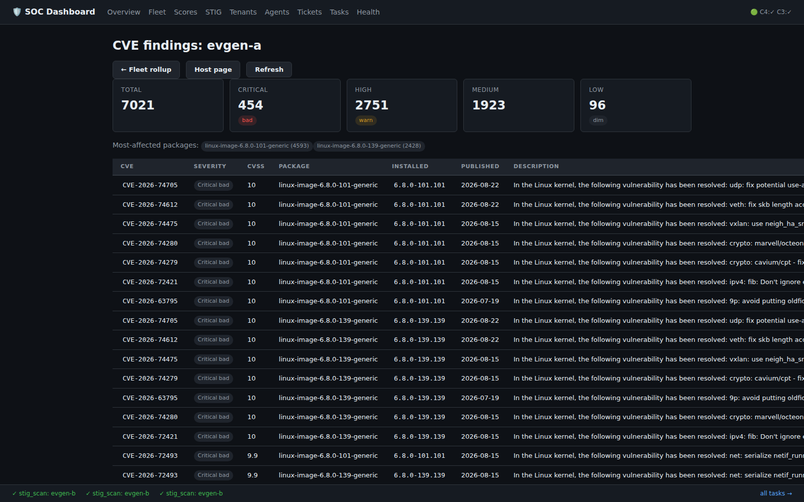

# Setup walkthrough — zero to running

A single-page, follow-along path from a bare host to a running SOC.
Every command here is real; the screenshots are the actual system at
each milestone. Time: ~30 minutes.

> Reference version of the same material: [docs/deploy-guide.md](../deploy-guide.md).
> This page is the "do this, then this" version.

## 0. What you end up with

A host running: a Wazuh manager + indexer + dashboard (docker), five
small MCP services (realtime ingest, audit, tickets, memory, C1/C2
managers), a web dashboard on `:8771`, an OpenClaw sub-agent fleet
(soc-narrator, soc-triage, soc-replier…), and systemd timers that run
scans, remediation passes, and a daily report. The decision flow lives
in [docs/architecture.md](../architecture.md).

## 1. Prerequisites

- Ubuntu 24.04 host (any machine that can SSH to your fleet)
- `python3` (3.12), `docker` + `docker compose`, `git`
- An OpenClaw gateway (the AI runtime; agents need it to take turns)
- Wazuh agents installed on the hosts you want to monitor

```bash
python3 --version && docker --version && git --version
```

## 2. Clone and configure

```bash
git clone https://github.com/dmrobbi/soc-openclaw.git
cd soc-openclaw
cp deploy/soc-stack.env.example deploy/soc-stack.env
$EDITOR deploy/soc-stack.env      # four knobs: SOC_HOME, SOC_USER,
                                  # SOC_STATE_DIR, SOC_MANAGER_BIND
```

Everything is derived from those knobs (install.sh reads
`deploy/soc-stack.env`). Secrets never live in the repo — they go to
`$SOC_SECRETS_DIR` as `chmod 600` env files:

```bash
# $SOC_SECRETS_DIR/wazuh-manager-api.env
WAZUH_API_USERNAME=...
WAZUH_API_PASSWORD=...
# $SOC_SECRETS_DIR/reports-mailbox.env  (SMTP creds for alert digests)
```

If you run the Wazuh stack from this repo's template
(`wazuh/docker-compose.yml`), set the gateway address + token via
`soc-stack.env` too:

```bash
# in soc-stack.env (gitignored — never commit real values)
OPENCLAW_GATEWAY_URL=ws://<gateway-host>:<port>
OPENCLAW_GATEWAY_TOKEN=<random 48-hex>
```

## 3. Wazuh stack (if not already running)

```bash
cd wazuh
# edit docker-compose.yml: replace the __...__ placeholders
# (__INDEXER_PASSWORD__, __SOC_HOST_LAN_IP__, __SMTP_HOST_IP__)
docker compose up -d
curl -sk https://127.0.0.1:55000 -o /dev/null -w '%{http_code}\n'   # manager
```

Details: [docs/deploy-guide.md §1](../deploy-guide.md), dashboards:
[docs/wazuh-dashboards.md](../wazuh-dashboards.md).

## 4. Install the SOC stack

Idempotent — safe to re-run. Preview first:

```bash
sudo SOC_DRY_RUN=1 bash deploy/install.sh    # shows every step
sudo bash deploy/install.sh                  # does it
```

This installs the systemd units (dashboard, MCPs, shippers, timers),
writes the runtime dirs, and registers the OpenClaw sub-agents.

## 5. Verify

```bash
curl -s http://127.0.0.1:8771/healthz | python3 -m json.tool   # dashboard
curl -s http://127.0.0.1:8767/healthz | python3 -m json.tool   # C2 manager
systemctl list-timers 'soc-*' --no-pager                       # the schedule
```

You should see the daily-report timer (06:00), the compliance pass
(06:30), and the weekly fleet scan (Sunday 03:00).



The `/` overview: your agents, 24h alert stats, tickets, STIG
findings. If this renders with data, the whole spine (ingest → audit →
dashboard) is alive.

## 6. First scan

Point the scanner at one host (it pushes the datastream over SSH,
evals, and merges results into the evidence store):

```bash
python3 services/scanner/soc_scanner.py --host <agent-name> --dry-run
python3 services/scanner/soc_scanner.py --host <agent-name>
```

Then rescore so the compliance pages reflect it:

```bash
python3 services/soc_score.py --tool score_all_tenants
```



`/fleet` now shows the host with a STIG column. Click a host:



The host page lists every OpenSCAP control with pass/fail plus two
buttons: **Dry run** (shows exactly what a fix would do, changes
nothing) and **Remediate** (does it — only when the mutation gate is
on). That pair of buttons is the whole remediation model in miniature.

## 7. Dashboard tour

The video covers every page in 50 seconds:
[walkthrough-dashboard.mp4](media/walkthrough-dashboard.mp4)

Page by page:

| | |
|---|---|
|  |  |
|  |  |
|  |  |

## 8. Next steps

- **Day-2 operations**: [operations.md](operations.md) — the daily
  loop, reports, gates, exceptions, troubleshooting.
- **Concepts**: [quickstart.md](../../quickstart.md).
- **Safety model**: [quickstart.md § "Safety model"](../../quickstart.md)
  — every mutation path and the gates that guard it.