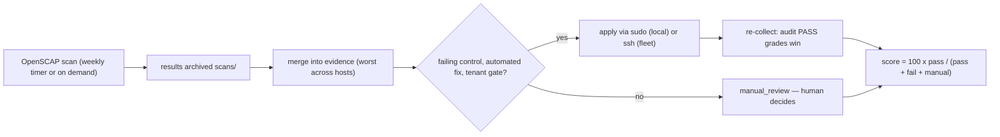
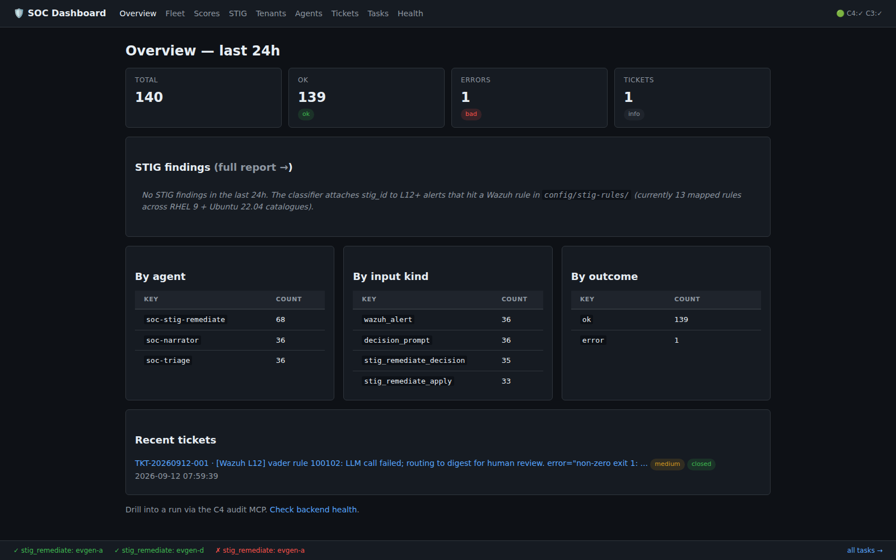
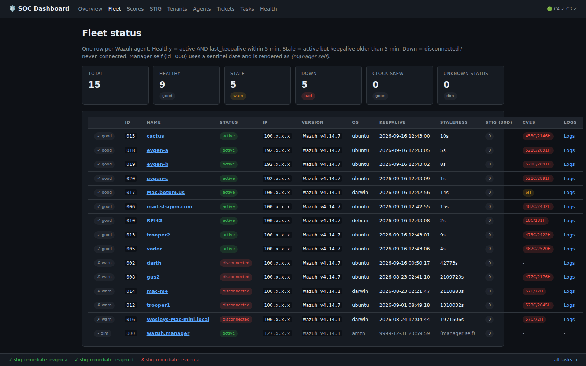
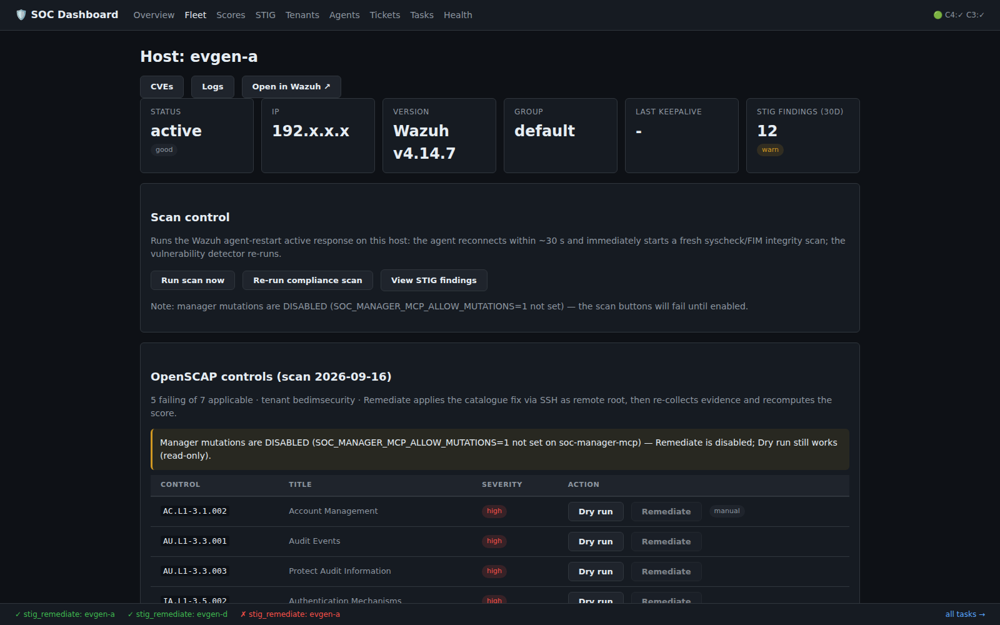
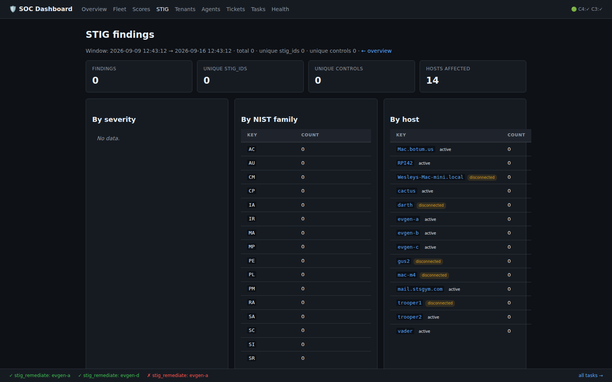
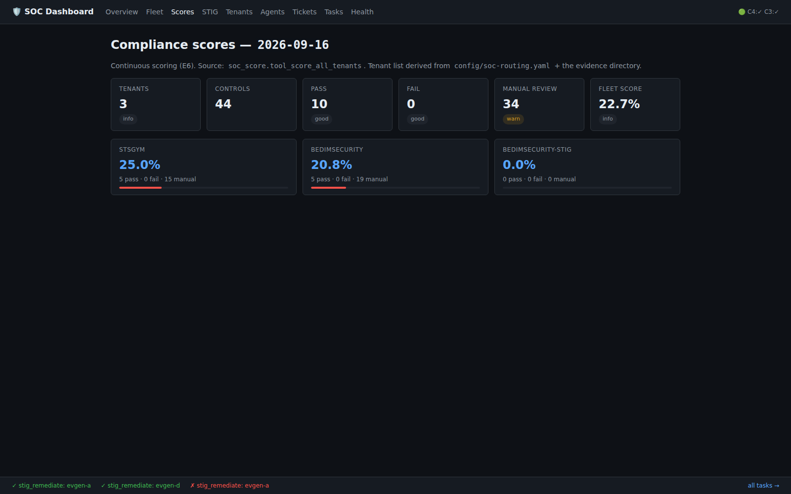
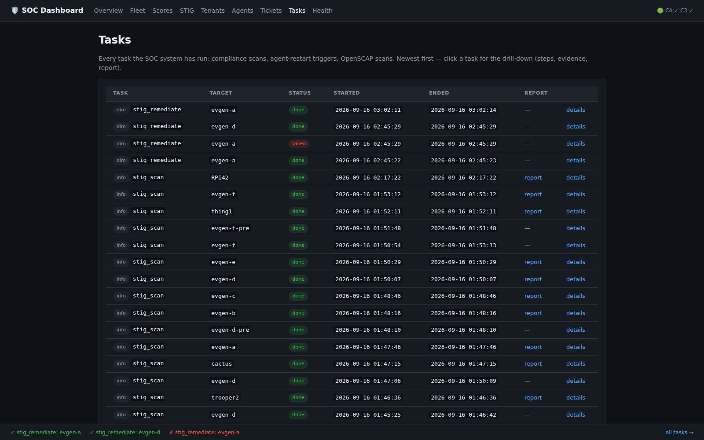

# Quickstart — how this SOC works

An agentic SOC in one picture: **Wazuh** watches the fleet, **OpenClaw
agents** think about what it sees, **timers** do the routine work, and a
**dashboard** shows everything — with humans reviewing exactly what the
automation refuses or escalates.

For the full component reference see [docs/architecture.md](docs/architecture.md)
(the decision-tree diagrams live there). Deployment:
[docs/deploy-guide.md](docs/deploy-guide.md). Onboarding a new host:
[docs/fleet-onboarding.md](docs/fleet-onboarding.md).

## The moving parts

| Piece | Port | Role |
|---|---|---|
| Wazuh manager / indexer | :55000 / :9200 | fleet agents, alerts, FIM, vulnerability detector |
| realtime-ingest | :8765 | receives every shipped alert, triages, escalates |
| soc-wazuh-mcp (C1) | :8766 | indexer queries: alerts, vulnerabilities, agent OS |
| soc-manager-mcp (C2) | :8767 | Wazuh manager API proxy — mutations gated |
| soc-tickets-mcp (C3) | :8768 | incident ticket store |
| soc-audit-mcp (C4) | :8769 | the SOC audit log — every LLM call + agent run |
| dashboard | :8771 | the SPA you look at |

Plus the **managing agent**: an OpenClaw agent that operates this stack
day to day — you can literally ask it in chat to scan a host, fix a
finding, or repair a service.

## What runs when

| When | What |
|---|---|
| continuous | Wazuh alerts → L12+ alerts get narrated, triaged, e-mailed, escalated into tickets |
| every 5 min | audit + realtime records mirrored to the agent-side host (trooper2) |
| hourly | healthcheck: unit/ACL/drift assertions, alerts on failure |
| 06:00 UTC | daily decisions report (what the SOC saw and did yesterday) |
| 06:30 UTC | nightly compliance loop (below) |
| Sunday 03:00 UTC | fresh OpenSCAP scans of the whole fleet |

## How an alert becomes action

1. A Wazuh agent detects something → alert reaches the manager.
2. The manager's `agentic-soc-send` integration fires for **level ≥ 12**
   rules: LLM narration → LLM triage decision → routing per the tenant
   config (email / page / log-only) → POST to realtime-ingest.
3. High/critical severity → **incident ticket** (human queue).
4. Everything lands in the realtime JSONL + audit log; the STIG
   classifier attaches `stig_id` + control to hits on mapped rules.
5. The 06:00 report summarizes all of it.

## How compliance works end-to-end



The nightly loop (06:30) re-runs the middle of this chart against
whatever scans exist, so remediation results show up on the dashboard
without waiting for Sunday. Fleet remediation is allowlist-scoped
(`SOC_AUTO_REMEDIATE_FLEET_HOSTS`) and every apply writes a snapshot +
audit row before touching anything.

## Where data lives

| Path | Contents |
|---|---|
| `~/.openclaw/soc/scans/<day>/` | archived OpenSCAP results + manifest |
| `~/.openclaw/soc/compliance/evidence/` | per-tenant, per-day control evidence |
| `~/.openclaw/compliance/snapshots/` | pre-remediation snapshots |
| `~/.openclaw-wazuh/audit_log.jsonl` | the canonical SOC audit log |
| `$SOC_STATE_DIR/data/realtime_soc.jsonl` | realtime alert/incident record |

## Operating it

- **Look**: dashboard pages `/` `/tenants` `/fleet` `/fleet/<host>`
  `/stig` `/stig/host/<host>` `/cve/<host>` `/logs/<host>` `/tasks`
  `/scores` `/tickets`.
- **Act**: fleet-host page buttons — Run scan, Re-run compliance scan,
  and per-control **Dry run / Remediate** in the OpenSCAP controls
  section. Mutating buttons are disabled until the owner sets
  `SOC_MANAGER_MCP_ALLOW_MUTATIONS=1` on soc-manager-mcp (systemd env
  file — put comments on their own line; inline comments poison the
  value) and the service restarts.
- **CLI equivalent**: `python3 services/soc_stig_remediate.py --tool
  remediate_control --args '{"control_id":"...","tenant_id":"...",
  "confidence":0.95,"dry_run":true}'` — add `"host":"<fleet host>"` for
  fleet targets; drop `dry_run` to apply (root-needing local fixes run
  under `sudo -n env ...`).
- **Ask the agent**: the managing OpenClaw agent can do all of the above
  and repair services when checks fail.

## Safety model (the gates, in order)

1. **C2 mutation gate** — `mutations_enabled` on manager-mcp `/healthz`
   gates every dashboard mutation (dry runs bypass it: they change
   nothing).
2. **Tenant policy** — `allowed_actions` must include `auto_remediate`,
   confidence ≥ `auto_remediation_threshold`, severity eligible.
3. **Catalogue hygiene** — only `automated: true` controls with
   pure-shell, idempotent fixes ever run; everything else is
   manual_review (a *neutral* grade, never counted as failure).
4. **Fleet allowlist** — nightly fleet remediation touches only
   allowlisted hosts; everything else is skipped.
5. **Audit trail** — every apply/rollback writes a snapshot + audit row;
   every LLM call is audited too.

## First ten minutes

```bash
curl -s http://127.0.0.1:8771/healthz | python3 -m json.tool   # dashboard up
curl -s http://127.0.0.1:8767/healthz | python3 -m json.tool   # mutations state
curl -s -X POST http://127.0.0.1:8771/tools/host_control_status \
     -H 'Content-Type: application/json' -d '{}'               # who fails what
journalctl -u soc-compliance-daily.service --since today | tail -40
```

Then open `http://<this-host>:8771/` and click through Fleet → a host →
OpenSCAP controls → Dry run on a failing control. That dry run is the
whole pipeline in miniature: gates checked, nothing changed, result
shown.

**Follow-along versions of this:** [setup walkthrough](docs/walkthroughs/setup.md)
· [operations walkthrough](docs/walkthroughs/operations.md) ·
[50-second video tour](docs/walkthroughs/README.md#video--the-dashboard-in-50-seconds)

## The system, actually running

Real pages from the live dashboard (IPs redacted to the first octet;
the mutations-disabled notice in the host shot is the genuine gate
state). More in [docs/screenshots/](docs/screenshots/README.md).

| | |
|---|---|
|  |  |
|  |  |
|  |  |

Per-host views: [STIG host](docs/screenshots/05-stig-host.png) ·
[CVE host](docs/screenshots/08-cve-host.png).